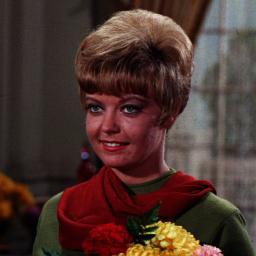
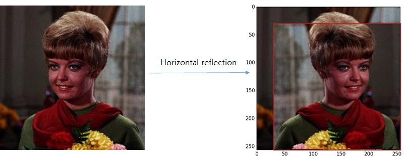

# CNNs

#Augmentataion Method 1 

original Image 

we extract 224 X 224 Image from original Image and do horizontal reflections 

so we increase images by a factor of 2048 for preventing overfitting

this augmentation make us more deep layer and wide layer 

#how to augmentation?

from left top to right buttom we extract 224 x 224 Image patches and do horizontal reflection in turn ,
as a result, training set by a factor of 2048(=32x32x2).
at the final layer that predict image what is makes a prediction by extracting
five 224 × 224 patches (the four corner patches and the center patch) as well as their horizontal
reflections (hence ten patches in all), and averaging the predictions made by the network’s softmax
layer on the ten patches.
